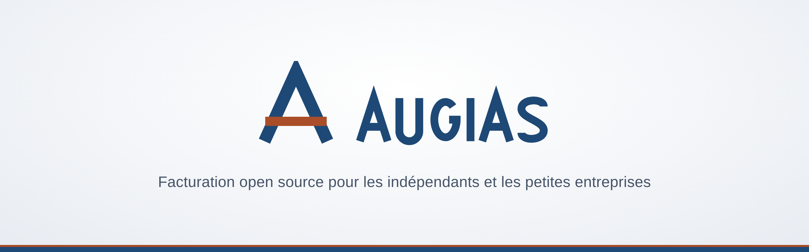
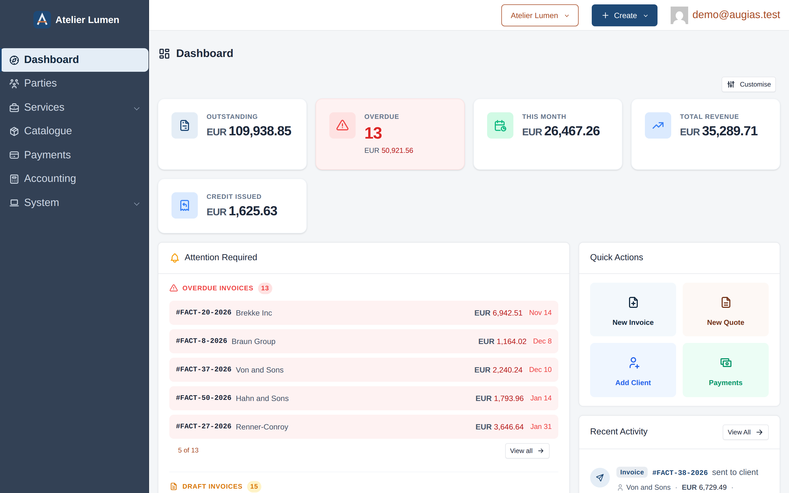
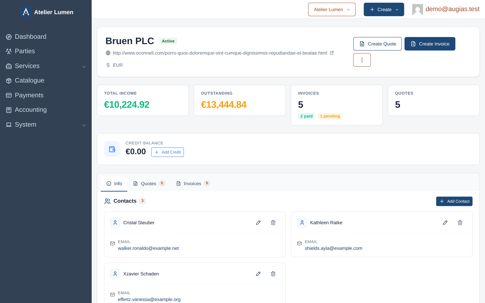
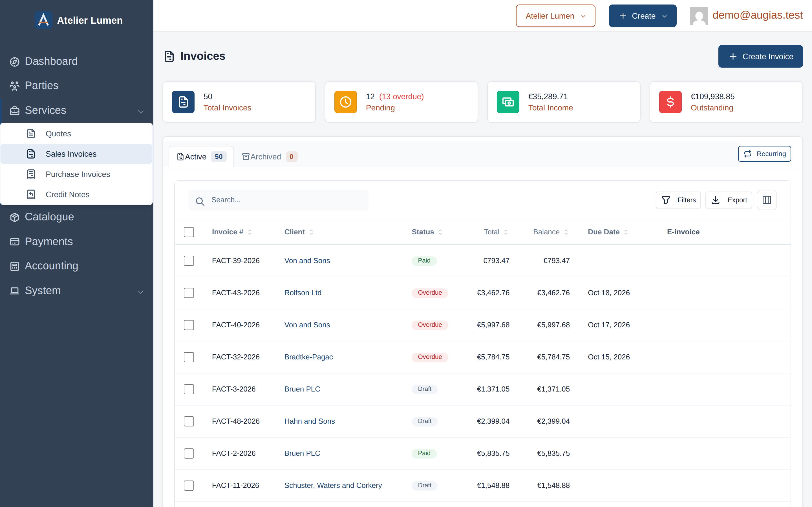
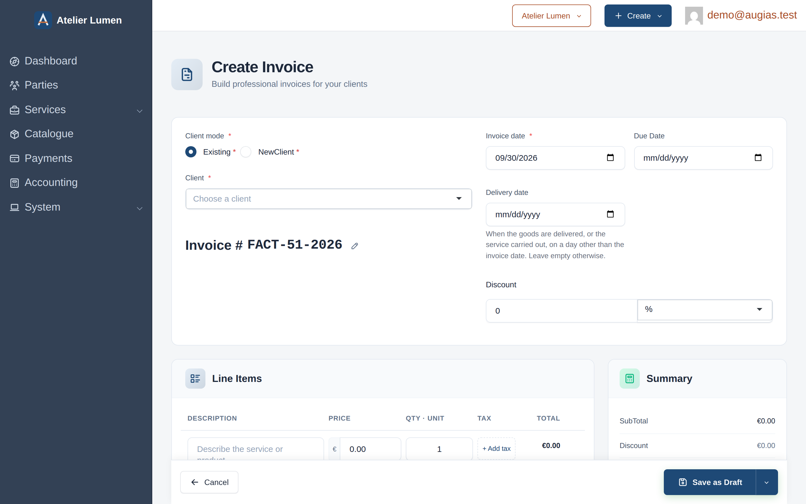
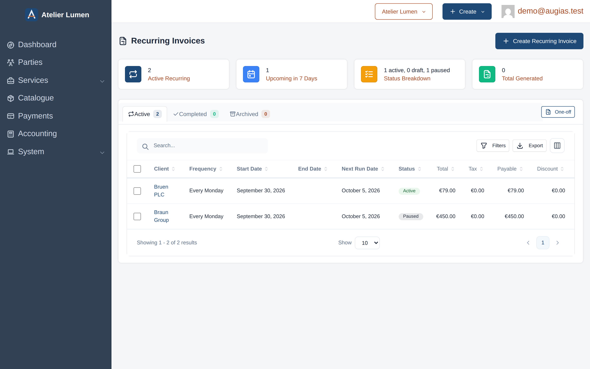
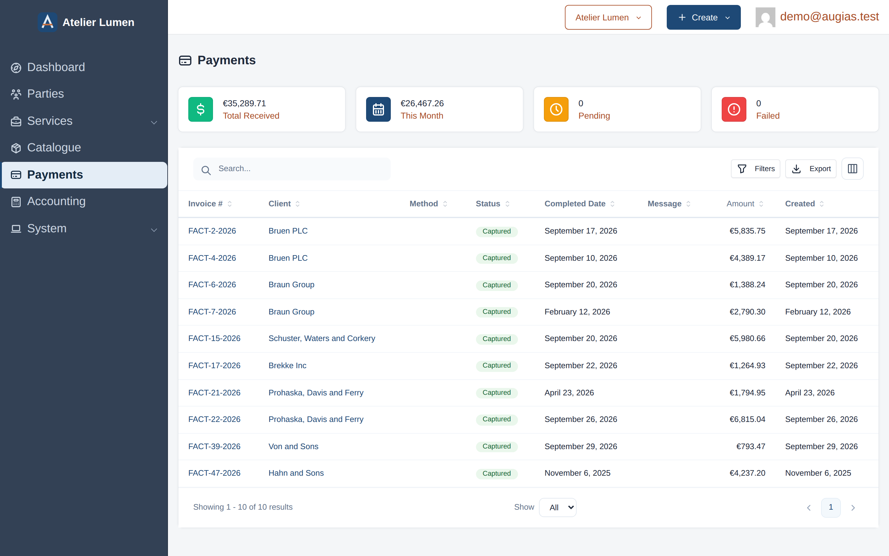

<div align="center">



# Augias

**The open-source invoicing platform for freelancers and small businesses.**

Send quotes and invoices, issue and receive French electronic invoices (Factur-X), keep your books — and own every byte of your data.

<p>
  <a href="https://github.com/herc-si/Augias/blob/HEAD/LICENSE"></a>
  <a href="https://github.com/herc-si/Augias/releases"></a>
  <a href="https://www.php.net/"></a>
  <a href="https://symfony.com/"></a>
  <a href="https://github.com/herc-si/Augias/stargazers"></a>
</p>

<p>
  <a href="https://github.com/herc-si/Augias"></a>
</p>



</div>

---

## Why Augias?

Most invoicing tools force a trade-off: easy to use *or* respectful of your data. Augias gives you both. It's a billing and bookkeeping platform for French freelancers and small businesses that you can run on your own server for free, or have hosted by [HERC SI](https://www.herc-si.fr) — no lock-in, full export at any time. Built on Symfony 8.1 and PHP 8.4, it's designed to be extended, integrated, and trusted.

---

## 🇫🇷 French e-invoicing and bookkeeping

Since 1 September 2026 every French business must be able to **receive** electronic invoices; small and micro businesses must **issue** them and send their e-reporting data from 1 September 2027 ([impots.gouv.fr](https://www.impots.gouv.fr/professionnel/je-decouvre-la-facturation-electronique)). Augias is built for it:

- **Factur-X** invoices and credit notes (EN 16931), generated with every invoice
- **Sending and receiving through a dematerialisation platform** — a connector for [SUPER PDP](https://www.superpdp.tech) ships today, behind a provider interface open to others
- Status tracking of every invoice sent, and accept / dispute / refuse answers to the ones you receive
- **E-reporting** of B2C transactions and payments
- Supplier invoices imported straight from their Factur-X, no retyping
- French tax rules where they matter: VAT on goods vs services, VAT on debits, deposits, discounts before tax, *débours* kept out of turnover, VAT-exempt mention (art. 293 B CGI)

And the books that follow from it:

- Revenue book and purchase register (micro-entreprise), sales and purchase journals (réel), written automatically from your documents
- Accounting regimes (micro-entreprise, réel), fiscal year, period closing and a lock date
- Turnover and **VAT returns (CA3)** prepared from the books
- **FEC** export (fichier des écritures comptables) for a tax audit
- Bank statement import (CAMT, OFX, CSV) and reconciliation

> [!NOTE]
> Augias is a tool, not an accountant: check what it prepares with your adviser.

---

## ✨ Features

### 💼 Billing & Invoicing
- Quotes that convert into invoices in one click
- Recurring invoices on flexible schedules
- Multi-currency support (real `Money` objects — no float rounding)
- Multi-tax support with invoice-level tax and automatic rate snapshot on issue
- Flat-rate and percentage tax types, plus per-line discounts
- 8 built-in PDF templates for invoices and quotes
- Automatic overdue detection with configurable notifications
- Payment reminders sent on a schedule you define
- Create a new client directly from the invoice or quote form
- Invoice state machine (draft → pending → paid)

### 👥 Clients & Contacts
- Full client and contact management
- Custom fields for clients and contacts
- Per-client currency, addresses and contact channels
- Multi-tenancy out of the box (run multiple companies from one install)

### 🔐 User & Security
- Two-Factor Authentication (2FA) via TOTP
- Google OAuth login
- User email verification
- Role-based access control with Symfony Security & Voters
- Guided onboarding flow with a checklist for new users

### 💳 Payments
- Bring-your-own Stripe, PayPal and other gateways via [Payum](https://payum.gitbook.io/payum/)
- Online payment links sent with invoices
- PCI-compliant — no card data ever touches your server

### 🔌 Integrations & API
- REST API (JSON-LD, JSON-HAL, JSON, XML) powered by [API Platform 4](https://api-platform.com/)
- Token-based auth (`X-API-TOKEN`)
- Built-in MCP server with OAuth2 for AI agent automation
- Meilisearch integration for fast full-text search across all data
- Grid export and full company data export
- Notifications via email, SMS and chat channels

### 🛡 Privacy & Ownership
- 100% self-hostable — your database, your rules
- Encrypted secrets, Doctrine multi-tenancy filters
- MIT licensed — fork it, modify it, ship it

### 🚀 Modern Stack
- Symfony 8.1, PHP 8.4, Doctrine ORM, API Platform 4
- Tabler UI on Bootstrap 5.3 — fully responsive, mobile-friendly
- Stimulus, Webpack Encore, Bun, Sass
- Helm charts for Kubernetes, opt-in Prometheus metrics
- Symfony Messenger for async task processing
- ULID primary keys, PHPStan level 6, ECS, Rector

---

## 🏠 Self-Hosted vs. ☁️ Hosted

Both versions ship the same codebase and feature set. Pick whichever fits your workflow.

|                | 🏠 **Self-Hosted** (Free, MIT)  | ☁️ **Hosted by HERC SI**                     |
| -------------- | ------------------------------- | -------------------------------------------- |
| Price          | Free forever                    | A free plan, and paid plans for automation   |
| Setup          | You install & maintain          | Sign up and send                             |
| Updates        | Manual                          | Automatic                                    |
| Data location  | Your server                     | Hosted in Europe (Infomaniak)                |
| Data ownership | Full                            | Full — export anytime                        |
| Best for       | Tinkerers, privacy-first teams  | Anyone who wants to invoice today            |

---

## 📸 Screenshots

| | |
| :---: | :---: |
| <br/>**Dashboard** | <br/>**Client View** |
| <br/>**Invoice List** | <br/>**Invoice Editor** |
| <br/>**Recurring Invoices** | <br/>**Payments** |

---

## 🚀 Quick Start

### Option 1 — Docker Compose from source (recommended)

```bash
git clone https://github.com/herc-si/Augias.git
cd Augias
docker compose -f docker-compose.dev.yml up
```

Composer and frontend dependencies install themselves into named volumes on the
first run, so nothing needs to be present on the host. The application is served
on `http://localhost:8765`.

### Option 2 — Single binary

Get up and running in seconds with a self-contained binary — no PHP, no web server, no extensions to install.

**Direct binary download:**

Grab the latest binary for your platform from the [releases page](https://github.com/herc-si/Augias/releases), make it executable, and run it:

```bash
chmod +x augias
./augias run
```

That's it — open `http://localhost:8765` and you're invoicing.

### Option 3 — From source (for developers)

```bash
git clone https://github.com/herc-si/Augias.git
cd Augias
composer install
bun install && bun run dev
```

For production builds:

```bash
bun run build
```

**Requirements:** PHP 8.4.1+, ext-curl, ext-gd, ext-intl, ext-openssl, ext-pdo, ext-soap, ext-xsl, MySQL/MariaDB or PostgreSQL.

---

## 🛠 Tech Stack

**Backend:** Symfony 8.1 · PHP 8.4 · Doctrine ORM · API Platform 4 · Payum · MoneyPHP
**Frontend:** Tabler · Bootstrap 5.3 · Stimulus · Webpack Encore · Bun · Sass
**Quality:** PHPStan (level 6) · ECS · Rector · PHPUnit · Foundry · GitHub Actions

---

## 📚 Documentation

- 📖 Docs & guides — the `docs/` directory in this repository
- 🔄 Upgrading — [`UPGRADE.md`](UPGRADE.md)
- 📝 Changelog — [`CHANGELOG.md`](CHANGELOG.md)

---

## 🤝 Contributing

We love contributions of every shape — code, docs, translations, bug reports, ideas. Look for the [`good first issue`](https://github.com/herc-si/Augias/labels/good%20first%20issue) label to get started, then read the [contributing guide](CONTRIBUTING.md) and our [code of conduct](CODE_OF_CONDUCT.md).

---

## 🔒 Security

Found a vulnerability? Please **do not** open a public issue. See [`SECURITY.md`](SECURITY.md) for our responsible disclosure process.

---

## 💖 Acknowledgements

Augias is a fork of **[SolidInvoice](https://github.com/SolidInvoice/SolidInvoice)**
by Pierre du Plessis / SolidWorx, released under the MIT License. Essentially all
of the application below the rebrand is their work.

The upstream project is supported by **[JetBrains](https://www.jetbrains.com/)**
(PhpStorm licenses), **[Docker](https://www.docker.com/)** (Docker Hub) and
**[Sentry](https://sentry.io/)** (Business plan). Those sponsorships are theirs,
not this fork's — they are listed here as credit, not as a claim.

---

## 📄 License

Augias is open-source software released under the [MIT License](LICENSE),
inherited from SolidInvoice. The copyright notice of the original author is
retained in `LICENSE` and in every source file, as the licence requires.

---

<div align="center">

**[Releases](https://github.com/herc-si/Augias/releases)** · **[Docs](docs/)** · **[Upstream project](https://github.com/SolidInvoice/SolidInvoice)**

Built on [SolidInvoice](https://github.com/SolidInvoice/SolidInvoice) by [SolidWorx](https://solidworx.co) and its [contributors](https://github.com/SolidInvoice/SolidInvoice/graphs/contributors).

</div>

